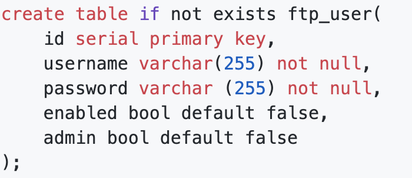

# Spring Tips: FTP Integration 

Hi, Spring fans! In this installment of Spring Tips, we look at a topic that's near and dear to my heart: integration! And yes, you may recall that the very first installment of _Spring Tips_ looked at Spring Integration. If you haven't already watched that one, [you should](https://www.youtube.com/watch?v=MTKlk8_9aAw&list=PLgGXSWYM2FpPw8rV0tZoMiJYSCiLhPnOc&index=69). So, while we're not going to revisit Spring Integration fundamentals, we're going to take a deep dive into one area fo support in Spring Integration: FTP. FTP is all about file synchronization. Broadly, in the world of Enterprise Application Integration (EAI), we have four types of integration: file synchronization, RPC, database synchronization, and messaging. 

File synchronization is definitely not what most people think of when they think of cloud-native applications, but you'd be surprised just how much of the world of finance is run by file synchronization (FTP, SFTP, AS2, FTPS, NFS, SMB, etc.) integrations. Sure, most of them use the more secure variants, but the point is still valid. In this video, we look at how to use Spring Integration's FTP support, and once you understand that, it's easy enough to apply it to other variants. 

Please indulge me in a bit of chest-thumping here: I thought that I knew everything I'd needed to know about Spring Integration's FTP support since I had a major role in polishing off Iwein Fuld's original prototype code more than a decade ago, and since I contributed the original FTPS and SFTP adapters. In the intervening decade, surprising nobody, the Spring Integration team has added a _ton_ of new capabilities and fixed all the bugs in my original code! I love what's been introduced. 

So, first things first: we need to set up an FTP server. Most of Spring Integration's support works as a client to an already installed FTP server. So, it doesn't matter what FTP server you use. However, I'd recommend you use the [Apache FTPServer project](https://mina.apache.org/ftpserver-project/). It's a project that's a sub-project of the Apache Mina project, which is,  just so you know, the precursor to the Netty project. The Apache FTP Server is a super scalable, lightweight, all-Java implementation of the FTP protocol. And, you can easily embed it inside a Spring application. I've done so in the [Github repository for this video](http://github.com/spring-tips/ftp-integration). I defined a custom `UserManager` class to manage FTP user accounts. The custom `UserManager` that talks to a local PostgreSQL database with a simple table `ftp_user`, whose schema is defined thusly:

<!--
```sql
create table if not exists ftp_user(
    id serial primary key,
    username varchar(255) not null,
    password varchar (255) not null,
    enabled bool default false,
    admin bool default false
);
```
-->



I've got two users in there, `jlong` and `grussell`, both of which have a password of `pw`. I've set `enabled` and `admin` to `true` for both records. We use these two accounts later, so make sure you insert them into the table, like this. 

```sql
insert into ftp_user(username, password, enabled, admin) values ('jlong', 'pw', true, true);
insert into ftp_user(username, password, enabled, admin) values ('grussell', 'pw', true, true);
```

I'm not going to reprint the code for the FTP server here in its entirety. If you want to peruse it, I'd recommend you look at the [`FtpServerConfiguration` ](https://github.com/spring-tips/ftp-integration/blob/master/mina-ftp-server/src/main/java/ftp/FtpServerConfiguration.java) and [`FtpUserManager`](https://github.com/spring-tips/ftp-integration/blob/master/mina-ftp-server/src/main/java/ftp/FtpUserManager.java). 

In most cases, we don't have any ability to change the FTP server. If we want to be notified of any changes in a remote file system, our client needs to connect, scan the directory, and compare it with an earlier, known state. Basically, the client computes the delta and publishes an event. But wouldn't it be nice if the FTP server could broadcast an event when something happens? That way, there can be no doubt about what happened. And there's no doubt that we observed every change. If we were using any other FTP server, this would be more of a wish than a possibility. But as we're using the Apache FTP Server, Spring Integration offers us some interesting possibilities. We can install an `FTPlet`, kind of like a filter, that will broadcast any important events on the FTP server as `ApplicationContext` events. Then, we can use Spring Integration to publish interesting events as messages that we can process in Spring Integration. This capability is a new feature in Spring Integration. 

```java
package ftp;

import lombok.extern.log4j.Log4j2;
import org.springframework.context.annotation.Bean;
import org.springframework.context.annotation.Configuration;
import org.springframework.integration.dsl.IntegrationFlow;
import org.springframework.integration.dsl.IntegrationFlows;
import org.springframework.integration.dsl.MessageChannels;
import org.springframework.integration.event.inbound.ApplicationEventListeningMessageProducer;
import org.springframework.integration.ftp.server.ApacheMinaFtpEvent;
import org.springframework.integration.ftp.server.ApacheMinaFtplet;
import org.springframework.integration.handler.GenericHandler;
import org.springframework.messaging.MessageChannel;

@Log4j2
@Configuration
class IntegrationConfiguration {

	@Bean
	ApacheMinaFtplet apacheMinaFtplet() {
		return new ApacheMinaFtplet();
	}

	@Bean
	MessageChannel eventsChannel() {
		return MessageChannels.direct().get();
	}

	@Bean
	IntegrationFlow integrationFlow() {
		return IntegrationFlows.from(this.eventsChannel())
			.handle((GenericHandler<ApacheMinaFtpEvent>) (apacheMinaFtpEvent, messageHeaders) -> {
                log.info("new event: " + apacheMinaFtpEvent.getClass().getName() + 
                     ':' + apacheMinaFtpEvent.getSession());
				return null;
			})
			.get();
	}

	@Bean
	ApplicationEventListeningMessageProducer applicationEventListeningMessageProducer() {
		var producer = new ApplicationEventListeningMessageProducer();
		producer.setEventTypes(ApacheMinaFtpEvent.class);
		producer.setOutputChannel(eventsChannel());
		return producer;
	}
}
```

This example sets up a Spring  Integration messaging flow that listens for the relevant events and logs them out. Obviously, we're doing too much with this new information, but the thing to keep in mind is that... _we TOTALLY could_! There are so many opportunities here. We could publish the events over Apache Kafka, RabbitMQ, or JMS for some other node to respond to. We could send an email inviting someone to participate in some workflow. The sky's the limit! 

Now, we've got a working server up and running on port `7777`, we can connect using a client. I use [Filezilla](https://filezilla-project.org/). Whatever client you use, try logging into the running FTP server on host `localhost`, port `7777`, user `jlong`, and password `pw`. Upload a file, rename it, etc., and then check the console of your application and you'll see the activity reflected in events.

## The FTP Client 

We've got a working server. Let's look at how Spring Integration can act as a client to your services. We'll work with the simplest abstraction and work our way up to more sophisticated capabilities. Create a new project on the [Spring Initializr](http://start.Spring.io), add `Lombok`, `Spring Integration`, and choose the latest version of Java. Then click `Generate` and open the project in your IDE. 

We're going to use the two accounts we defined earlier. Let's configure them in the `application.properties`.

```properties
##
## Josh
ftp1.username=jlong
ftp1.password=pw
ftp1.port=7777
ftp1.host=localhost
## 
## Gary
ftp2.username=grussell
ftp2.password=pw
ftp2.port=7777
ftp2.host=localhost
```

## The `FtpRemoteFileTemplate` 

The simplest way we can interact with an FTP server is to use the _very_ handy `FtpRemoteFileTemplate` that ships as part of Spring Integration. Here's an example. This first example defines a `DefaultFtpSessionFactory` that establishes a connection to one of the FTP accounts. Then we define a `FtpRemoteFileTemplate` using that `DefaultFtpSessionFactory`. Then, we define an initializer that uses that `FtpRemoteFileTemplate` to read a file on the remote file system, `hello.txt`, to a local file, `$HOME/Desktop/hello-local.txt`. It couldn't be simpler! 

```java
package com.example.integration;

import lombok.extern.log4j.Log4j2;
import org.springframework.beans.factory.InitializingBean;
import org.springframework.beans.factory.annotation.Value;
import org.springframework.context.annotation.Bean;
import org.springframework.context.annotation.Configuration;
import org.springframework.context.annotation.Profile;
import org.springframework.integration.ftp.session.DefaultFtpSessionFactory;
import org.springframework.integration.ftp.session.FtpRemoteFileTemplate;

import java.io.File;
import java.io.FileOutputStream;

@Log4j2
@Configuration
class FtpTemplateConfiguration {

	@Bean
	InitializingBean initializingBean(FtpRemoteFileTemplate template) {
		return () -> template
			.execute(session -> {
				var file = new File(new File(System.getProperty("user.home"), "Desktop"), "hello-local.txt");
				try (var fout = new FileOutputStream(file)) {
					session.read("hello.txt", fout);
				}
				log.info("read " + file.getAbsolutePath());
				return null;
			});
	}

	@Bean
	DefaultFtpSessionFactory defaultFtpSessionFactory(
		@Value("${ftp1.username}") String username,
		@Value("${ftp1.password}") String pw,
		@Value("${ftp1.host}") String host,
		@Value("${ftp1.port}") int port) {
		DefaultFtpSessionFactory defaultFtpSessionFactory = new DefaultFtpSessionFactory();
		defaultFtpSessionFactory.setPassword(pw);
		defaultFtpSessionFactory.setUsername(username);
		defaultFtpSessionFactory.setHost(host);
		defaultFtpSessionFactory.setPort(port);
		return defaultFtpSessionFactory;
	}

	@Bean
	FtpRemoteFileTemplate ftpRemoteFileTemplate(DefaultFtpSessionFactory dsf) {
		return new FtpRemoteFileTemplate(dsf);
	}
}
```

## The FTP Inbound Adapter

The next example looks at how to use an FTP inbound adapter to receive a new `Message<File>` whenever there's a new file on the remote file system. An inbound or outbound adapter is a unidirectional messaging component. An inbound adapter translates events from a remote system into new messages that are delivered into a Spring Integration flow. An outbound adapter translates a Spring Integration `Message<T>` into an event in a remote system. In this case, the FTP inbound adapter will publish a `Message<T>` into the Spring Integration code whenever a new file appears on the remote file system.

As before, we configure a `DefaultFtpSessionFactory`. Then, we configure an FTP inbound adapter that automatically synchronizes the remote file system whenever any file that matches the mask `.txt` arrives on the server. The inbound adapter takes the remote file, moves it to the local directory, and then publishes a `Message<File>` that we can do anything we'd like with. Here, I simply log the message. Try it out! Upload a file, `foo.txt`, to the FTP server and watch as - no more than a second later - it's downloaded and stored in the local file system under `$HOME/Desktop/local`.

```java

package com.example.integration;

import lombok.extern.log4j.Log4j2;
import org.springframework.beans.factory.annotation.Value;
import org.springframework.context.annotation.Bean;
import org.springframework.context.annotation.Configuration;
import org.springframework.context.annotation.Profile;
import org.springframework.integration.dsl.IntegrationFlow;
import org.springframework.integration.dsl.IntegrationFlows;
import org.springframework.integration.ftp.dsl.Ftp;
import org.springframework.integration.ftp.session.DefaultFtpSessionFactory;

import java.io.File;
import java.util.concurrent.TimeUnit;

@Log4j2
@Configuration
class InboundConfiguration {

	@Bean
	DefaultFtpSessionFactory defaultFtpSessionFactory(
		@Value("${ftp1.username}") String username,
		@Value("${ftp1.password}") String pw,
		@Value("${ftp1.host}") String host,
		@Value("${ftp1.port}") int port) {
		DefaultFtpSessionFactory defaultFtpSessionFactory = new DefaultFtpSessionFactory();
		defaultFtpSessionFactory.setPassword(pw);
		defaultFtpSessionFactory.setUsername(username);
		defaultFtpSessionFactory.setHost(host);
		defaultFtpSessionFactory.setPort(port);
		return defaultFtpSessionFactory;
	}

	@Bean
	IntegrationFlow inbound(DefaultFtpSessionFactory ftpSf) {
		var localDirectory = new File(new File(System.getProperty("user.home"), "Desktop"), "local");
		var spec = Ftp
			.inboundAdapter(ftpSf)
			.autoCreateLocalDirectory(true)
			.patternFilter("*.txt")
			.localDirectory(localDirectory);
		return IntegrationFlows
			.from(spec, pc -> pc.poller(pm -> pm.fixedRate(1000, TimeUnit.MILLISECONDS)))
			.handle((file, messageHeaders) -> {
				log.info("new file: " + file + ".");
				messageHeaders.forEach((k, v) -> log.info(k + ':' + v));
				return null;
			})
			.get();
	}
}
```

## The FTP Gateway 

Now, for our last stop, let's look at the Spring Integration FTP Gateway. In Spring Integration, a gateway is a component that sends data out (to a remote service) and then takes the response and brings it back into the Spring Integration flow. Or, alternatively, a gateway could take an incoming request from a remote system, bring it into the Spring Integration flow, and then send a response back out again. Either way, a gateway is a bidirectional messaging component. In this case, the FTP gateway takes Spring Integration `Message<T>`s, sends them to an FTP server and uploads them, and once they're uploaded, send the response (the acknowledgment, if nothing else) back into the Spring Integration code.

That would be useful in of itself if that's all we did. But, for this last example,  I want to conditionally upload a file to one of two FTP server accounts based on some criteria. You can imagine the scenario. An HTTP request comes, it's turned into a `Message<T>` that enters the Spring Integration flow, and it heads to the gateway. The only question is: to which account should the data be uploaded? Jane would probably not appreciate it if a file intended for John was uploaded to her account. 

We're going to use a `DelegatingSessionFactory<FTPFile>`. The `DelegatingSessionFactory<FTPFile>` has two constructors. One takes a `SessionFactoryLocator`, which you can use to make the decision at runtime which FTP account to use. The other takes a `Map<String, SessionFactory>` which in turn results in a `SessionFactoryLocator` that looks at some property of an incoming message (it's up to you which) and uses that as the key for a lookup in the map. 

We need some way to kick off the pipeline, so I created a simple HTTP endpoint that accepts an HTTP `POST` message and uses a path variable to establish a key that then gets sent into the integration flow. The integration flow has three steps. The first stage looks at the incoming message and configures the thread-local key for the `DelegatingSessionFactory`, then it forwards the message to the gateway which does the work of uploading the file to a remote file system, then it forwards the response from the upload to another component which clears the thread-local key. 


```java
package com.example.integration;

import org.apache.commons.net.ftp.FTPFile;
import org.springframework.beans.factory.annotation.Value;
import org.springframework.context.annotation.Bean;
import org.springframework.context.annotation.Configuration;
import org.springframework.context.annotation.Profile;
import org.springframework.expression.common.LiteralExpression;
import org.springframework.integration.dsl.IntegrationFlow;
import org.springframework.integration.dsl.MessageChannels;
import org.springframework.integration.file.remote.gateway.AbstractRemoteFileOutboundGateway;
import org.springframework.integration.file.remote.session.DelegatingSessionFactory;
import org.springframework.integration.file.support.FileExistsMode;
import org.springframework.integration.ftp.dsl.Ftp;
import org.springframework.integration.ftp.session.DefaultFtpSessionFactory;
import org.springframework.integration.ftp.session.FtpRemoteFileTemplate;
import org.springframework.integration.handler.GenericHandler;
import org.springframework.messaging.MessageChannel;
import org.springframework.messaging.support.MessageBuilder;
import org.springframework.web.servlet.function.RouterFunction;
import org.springframework.web.servlet.function.ServerResponse;

import java.util.Map;

import static org.springframework.web.servlet.function.RouterFunctions.route;

@Configuration
@Profile("gateway")
class GatewayConfiguration {

	@Bean
	MessageChannel incoming() {
		return MessageChannels.direct().get();
	}

	@Bean
	IntegrationFlow gateway(
		FtpRemoteFileTemplate template,
		DelegatingSessionFactory<FTPFile> dsf) {
		return f -> f
			.channel(incoming())
			.handle((GenericHandler<Object>) (key, messageHeaders) -> {
				dsf.setThreadKey(key);
				return key;
			})
			.handle(Ftp
				.outboundGateway(template, AbstractRemoteFileOutboundGateway.Command.PUT, "payload")
				.fileExistsMode(FileExistsMode.IGNORE)
				.options(AbstractRemoteFileOutboundGateway.Option.RECURSIVE)
			)
			.handle((GenericHandler<Object>) (key, messageHeaders) -> {
				dsf.clearThreadKey();
				return null;
			});
	}

	@Bean
	DelegatingSessionFactory<FTPFile> dsf(Map<String, DefaultFtpSessionFactory> ftpSessionFactories) {
		return new DelegatingSessionFactory<>(ftpSessionFactories::get);
	}

	@Bean
	DefaultFtpSessionFactory gary(@Value("${ftp2.username}") String username, @Value("${ftp2.password}") String pw, @Value("${ftp2.host}") String host, @Value("${ftp2.port}") int port) {
		return this.createSessionFactory(username, pw, host, port);
	}

	@Bean
	DefaultFtpSessionFactory josh(@Value("${ftp1.username}") String username, @Value("${ftp1.password}") String pw, @Value("${ftp1.host}") String host, @Value("${ftp1.port}") int port) {
		return this.createSessionFactory(username, pw, host, port);
    }

    @Bean
	FtpRemoteFileTemplate ftpRemoteFileTemplate(DelegatingSessionFactory<FTPFile> dsf) {
		var ftpRemoteFileTemplate = new FtpRemoteFileTemplate(dsf);
		ftpRemoteFileTemplate.setRemoteDirectoryExpression(new LiteralExpression(""));
		return ftpRemoteFileTemplate;
	}
    

	private DefaultFtpSessionFactory createSessionFactory(String username, String pw, String host, int port) {
		var defaultFtpSessionFactory = new DefaultFtpSessionFactory();
		defaultFtpSessionFactory.setPassword(pw);
		defaultFtpSessionFactory.setUsername(username);
		defaultFtpSessionFactory.setHost(host);
		defaultFtpSessionFactory.setPort(port);
		return defaultFtpSessionFactory;
    }

	@Bean
	RouterFunction<ServerResponse> routes() {
		var in = this.incoming();
		return route()
			.POST("/put/{sfn}", request -> {
				var name = request.pathVariable("sfn");
				var msg = MessageBuilder.withPayload(name).build();
				var sent = in.send(msg);
				return ServerResponse.ok().body(sent);
			})
			.build();
	}
}

```

You can try this flow out yourself by running `curl -XPOST http://localhost:8080/put/one`. That will upload a file to the FTP account whose bean name is `one`. Try  `curl -XPOST http://localhost:8080/put/two` to upload a file to the FTP account whose bean name is `two`. 

## Conclusion 

In this Spring Tips installment, we've looked at how to handle all sorts of FTP integration scenarios. You can use what you've learned here to work with the other support in the framework for remote file systems. 
